# Readme file for the website
Each section/page of the website is described separately below. Furthermore, all real life images are from Landcare NSW and Unsplash, except for the users' profile pictures that are from Phillip W.'s "This Person Does Not Exist" website and the map picture on the home page that was created by myself, Attila Fazekas (Landcare NSW, 2021; Unsplash, 2021; Phillip, 2019).

## Header
The header was the first section created for the website as each page has the same header. 

One of the changes that was made from the mockup stage was that the logo was changed in order to better suit the rectangular shape of the header, plus to not over crowd the top of the page when users are viewing the page on a mobile phone screen. This logo was then made into a link that links to the home page as suggested by users to provide a quicker access to the home page as this functionality is widespread on many websites.

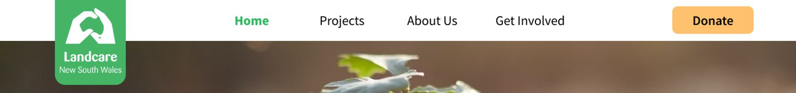
>
Mockup header on a larger screen size

 

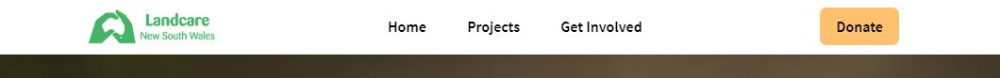
>
Prototype header on a larger screen size

 

One of the challenges for the header was to turn the navigation bar into a hamburger icon for smaller screens, but this was solved in the end using the combination of flex display attributes and the ability to completely hide items off the screen. Another challenge that was solved was to make the navigation link appear when the hamburger icon was clicked. This was not only challenging because of the functionality but also because it had to be designed from scratch as it was not implemented for the mockup stage. The functionality of hamburger icon menu was solved using Javascript due to having previous Javascript knowledge. However, there was a feature that I was not able to implement, which was to make the navigation links stay green (active mode) depending on which page the user is currently on.

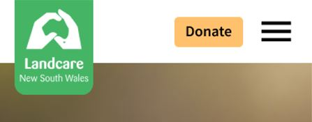
>
Mockup header on a smaller screen size

 

>
Prototype header on a smaller screen size

 

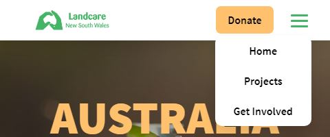
>
Prototype header's dropdown menu

 

Furthermore, the button's interactivity was not considered for the mockup stage, so it was implemented from scratch. Both the hover and onclick actions were implemented to make it enjoyable for users when they interact with buttons, as well as each button throughout the webpages has the same style for consistency in aestethics.

Additionally, a fixed position was added to the header with a small dropshadow, hence users can access each page of the website easily.

## Footer
The footer was the second section created for the website as each page has the same footer. Thus, from this stage only the main sections needed to be done for each page, which made development easier and more enjoyable.

The footer section was kept fairly consistent with the mockup, except for the "Stay Updated" section, where a label and a placeholder example was added to the form to make it more clear for users what the form is for and how it should be filled out. Furthermore, to make the button stand out and for consistency, it was designed similarly as the button in the header. Thus, users quickly come to associate the golden yellow colour with interactive buttons/forms throughout the website.

The copyright section was changed slightly as well, where the logo was changed to the same logo as the one in the header for consistency.

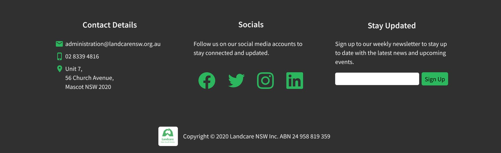
>
Prototype header on a larger screen size

 

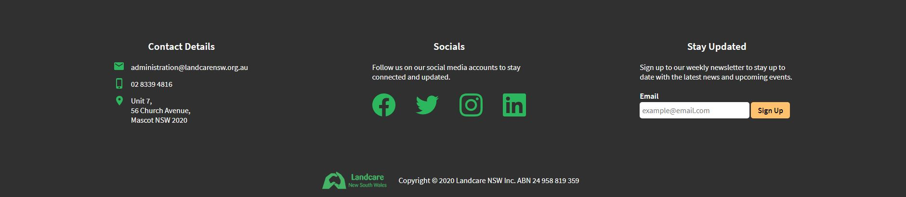
>
Prototype header on a larger screen size

## Main Page
Users suggested that it was a bit hard to read the text in the call-to-action section of the page, so a gradient was added to make the background darker and make the text and the button pop out. In addition to this, the heading's colour was changed and the paragraph's text size was increased for better readability for all users.

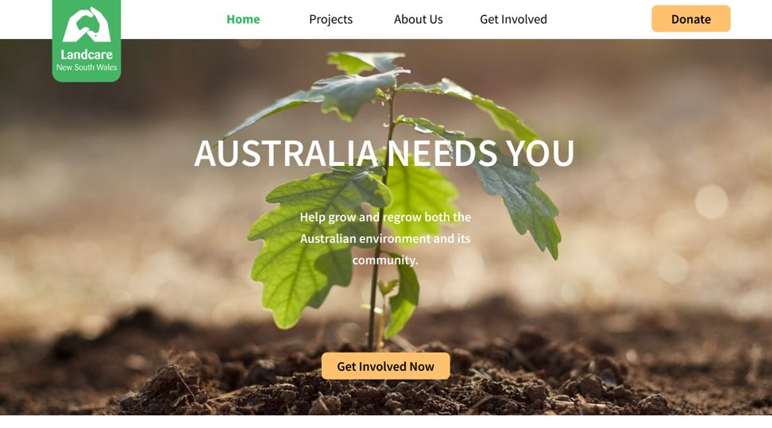
>
Mockup call-to-action section on a larger screen size

 

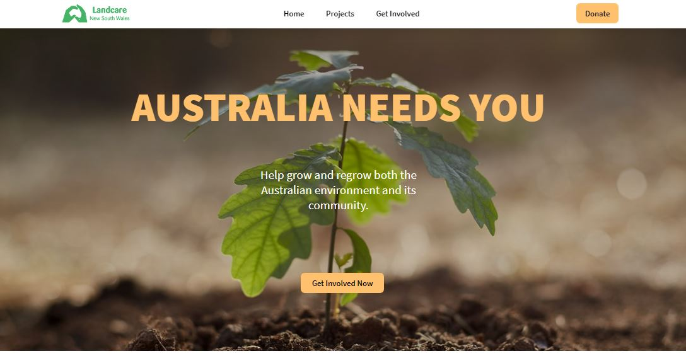
>
Prototype call-to-action section on a larger screen size

 

Throughout the testing, it was noticed by users that the "What We Do" section and the Projects page are very similar, almost identical, so the "About Us" page was removed and put in place of the "What We Do" section. Thus, there are no duplicates of information and it is much easier to traverse the whole website to find relavent information for users.

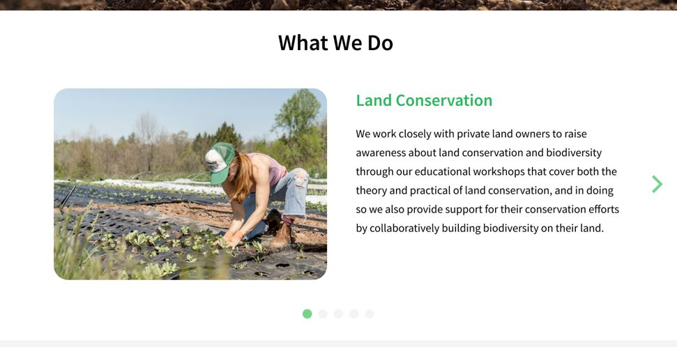
>
Mockup "What We Do" section on a larger screen size

 

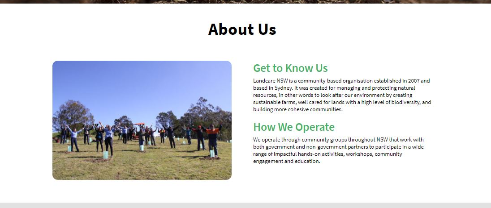
>
Prototype "About Us" section on a larger screen size

 

In the "Statistics" section, the background colour was changed to a darker grey in order to increase contrast between sections as well as the elements that are within the "Statistics" section, because the white and light grey were almost blending together in the mockup stage and it made it hard for users to distinguish between sections and elements.

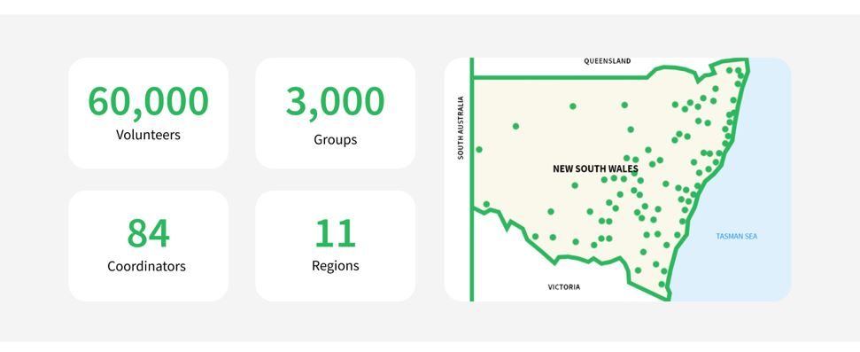
>
Mockup "Statistics" section on a larger screen size

 

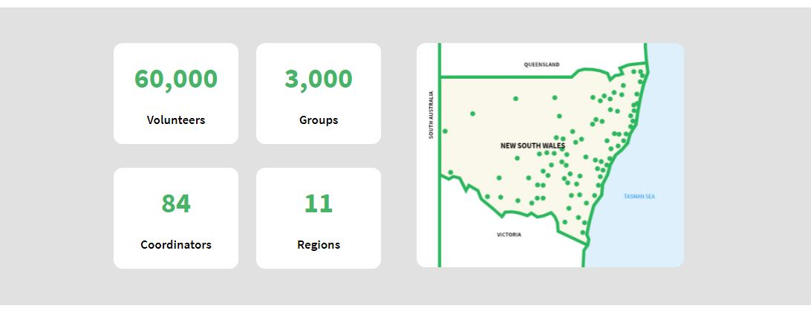
>
Prototype "Statistics" section on a larger screen size

 

One of the challenges on the main page was that we have not learnt how to make interactive sliders, so the design and stucture had to be rethought and reworked to be able to implement both the "Testimonials" and "Our Partners" sections without the use of sliders. The elements in the "Testimonials" section ended up looking very similar to the elements in the phone version of the "Testimonials" section in the mockup stage.

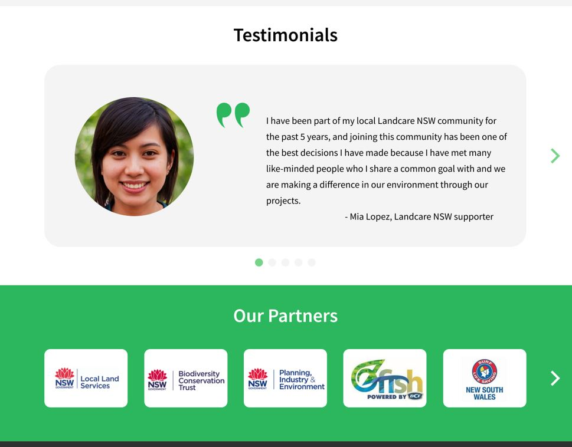
>
Mockup "Testimonials" and "Our Partners" sections on a larger screen size

 

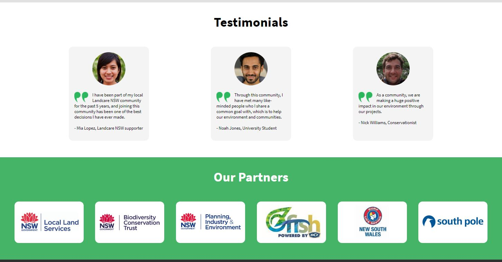
>
Prototype "Testimonials" and "Our Partners" sections on a larger screen size

 

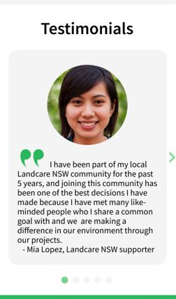
>
Mockup "Testimonials" section on a smaller screen size

## Projects Page
When testing the Projects page with users, there were no issues at all. All of them liked the simplicity and the layout of information so for the prototype, everything was kept exactly the same as the mockup.

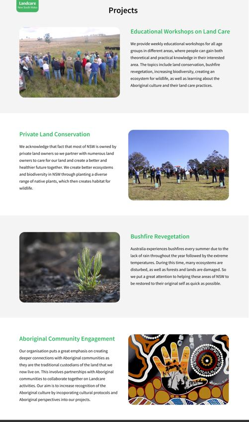
>
Mockup Projects page on a larger screen size

 

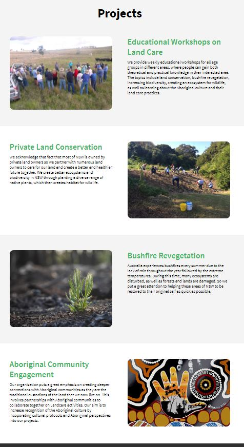
>
Prototype Projects page on a larger screen size

## Get Involved Page
Similarly to the Main page, the grey and white blended together too much and the white did not stand out so a 1px grey border was added to increase visability of each input section that users need to fill out. Another change that was made upon reflecting on the form's input sections is that their length were changed to be similar to one another for consistency. This can be seen in the pictures below.

When users click in a section, it focuses on that section by giving it an outline, thus users know exactly which section they are currently typing into. Furthermore, each input section has placeholder text to give an example to users about what they need to put in that input section. Lastly, the button's text was renamed from "Submit" to "Get Involved". These features remove any confusion that users may have about the form.

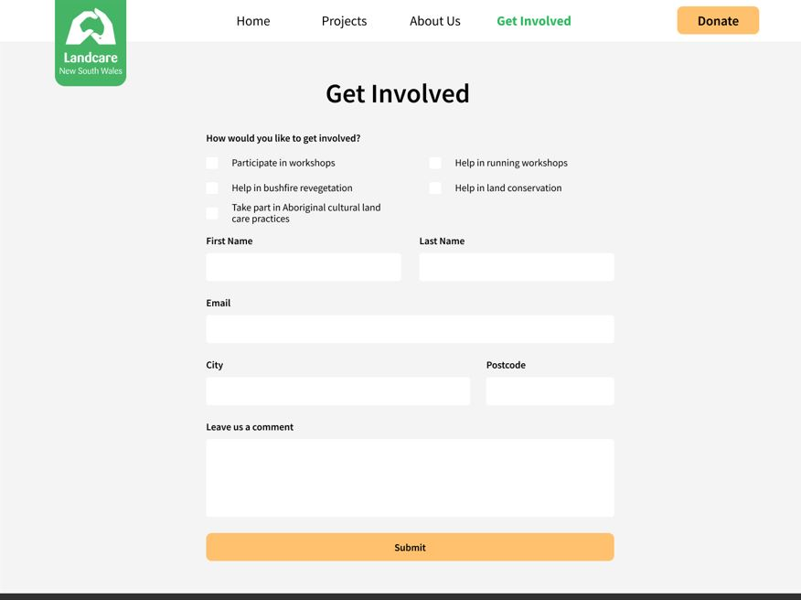
>
Mockup Get Involved page on a larger screen size

 

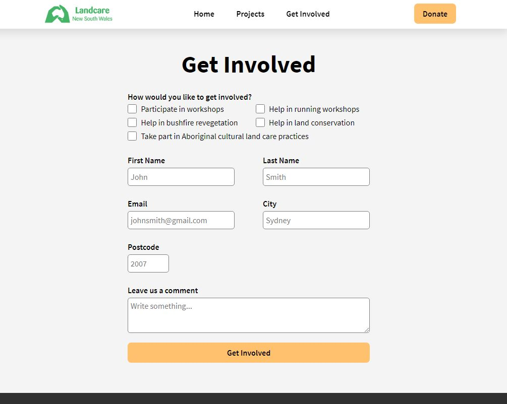
>
Prototype Get Involved page on a larger screen size

## Donate Page
Similarly to the Get Involved page, the input sections were changed to have a 1px grey border for better visability for users of all ages. Additionally, the lengths of the input sections were made identical for consistency, and placeholders were added to make it clear to users what they have to put into each input field. Further building on the Get Involved page, the button's text on the Donate page was changed as well to "Donate". Thus, all of these changes make the page more accessible and more clear to users what the form and each field is for.

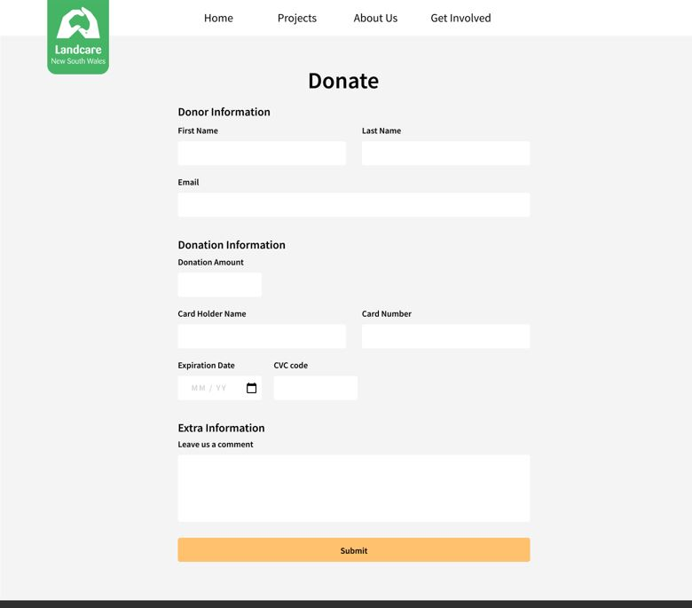
>
Mockup Donate page on a larger screen size

 

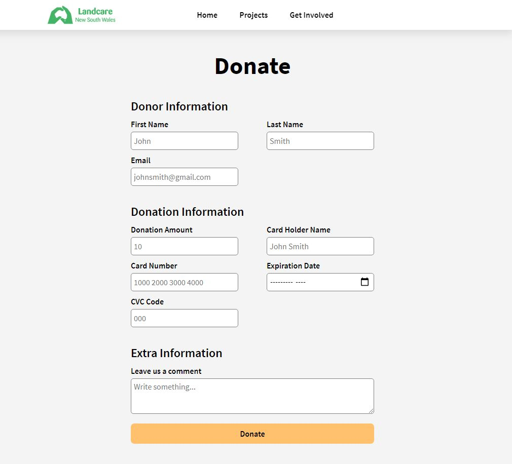
>
Prototype Donate page on a larger screen size

# Bibliography
Landcare NSW. (2021). Who is Landcare NSW?. Retrieved from https://landcarensw.org.au/

Phillip, W. (2019). This Person Does Not Exist. Retrieved from https://thispersondoesnotexist.com/

Unsplash. (2021). Beautiful Free Images & Pictures. Retrieved from https://unsplash.com/
